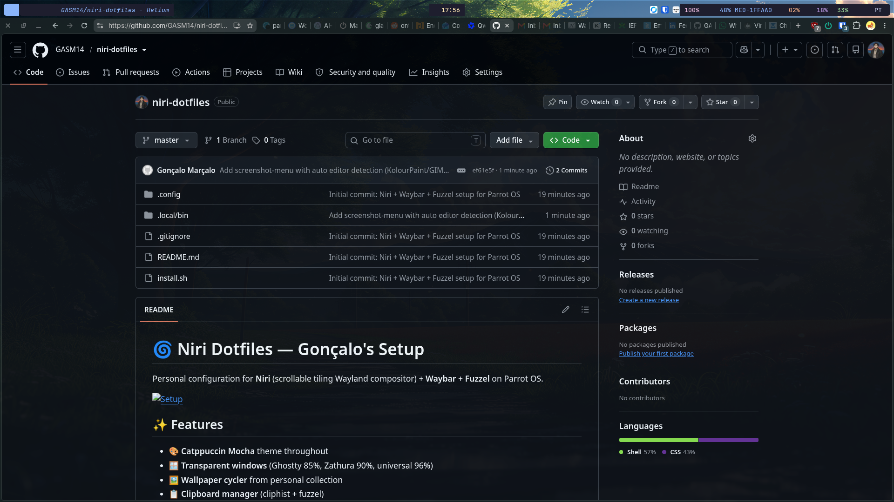

# 🌀 Niri Dotfiles — Gonçalo's Setup

Personal configuration for **Niri** (scrollable tiling Wayland compositor) + **Waybar** + **Fuzzel** on Parrot OS.



## ✨ Features

- 🎨 **Catppuccin Mocha** theme throughout
- 🪟 **Transparent windows** (Ghostty 85%, Zathura 90%, universal 96%)
- 🖼️ **Wallpaper cycler** from personal collection
- 📋 **Clipboard manager** (cliphist + fuzzel)
- 🔋 **Power menu** with performance profiles
- 🎯 **Vim-style navigation** (HJKL)
- 📱 **Flatpak + AppImage** integration
- 🎨 **Powerline-style** Waybar with animations

## 🛠️ Installation

### Prerequisites

```bash
# Core
sudo apt install niri waybar fuzzel swaybg swaylock mako-notifier cliphist wl-clipboard

# Utilities
sudo apt install playerctl brightnessctl pulsemixer power-profiles-daemon

# Optional (for scripts)
sudo apt install jq imagemagick
```

### Install configs

```bash
git clone https://github.com/YOUR_USERNAME/niri-dotfiles.git
cd niri-dotfiles

# Backup existing configs
cp -r ~/.config/niri ~/.config/niri.bak.$(date +%s) 2>/dev/null
cp -r ~/.config/waybar ~/.config/waybar.bak.$(date +%s) 2>/dev/null

# Copy configs
cp -r .config/niri ~/.config/
cp -r .config/waybar ~/.config/
cp -r .config/fuzzel ~/.config/
cp -r .local/bin/* ~/.local/bin/

# Make scripts executable
chmod +x ~/.local/bin/*

# Reload Niri
niri validate && niri msg action load-config-file
pkill waybar && waybar &
```

## ⌨️ Keybindings

| Key | Action |
|-----|--------|
| `Super + Space` | App launcher (fuzzel) |
| `Super + Enter` / `Super + Alt + T` | Terminal (Ghostty) |
| `Super + V` | Clipboard history |
| `Super + W` | Window overview |
| `Super + Shift + W` | Cycle wallpaper |
| `Super + Ctrl + T` | Toggle window transparency |
| `Super + S` | Screenshot (region) |
| `Super + Shift + S` | Screenshot (window) |
| `Super + Ctrl + S` | Screenshot (screen) |
| `Super + Q` | Close window |
| `Super + H/J/K/L` | Navigate (Vim-style) |
| `Super + 1-9` | Switch workspace |
| `Super + Alt + L` | Lock screen |
| `Super + Ctrl + Shift + Q` | Quit Niri |

## 🎨 Customization

### Wallpapers

Add your wallpapers to `~/Pictures/myshieldtvwallpapers/` and the cycler will pick them up automatically.

### Transparency

Edit `.config/niri/config.kdl`:

```kdl
window-rule {
    match app-id=r#"^com\.mitchellh\.ghostty$"#
    opacity 0.85
}
```

### Waybar modules

Edit `.config/waybar/config` to add/remove modules. See [Waybar wiki](https://github.com/Alexays/Waybar/wiki).

## 📦 Included Scripts

- `wallpaper-cycle` — Cycle through wallpapers in `~/Pictures/myshieldtvwallpapers/`

## 🐛 Troubleshooting

### Flatpaks not showing in fuzzel

Add to `~/.config/niri/config.kdl.local`:

```kdl
environment {
    XDG_DATA_DIRS "/var/lib/flatpak/exports/share:/home/goncalom/.local/share/flatpak/exports/share"
}
```

### AppImages not showing

Create `.desktop` files in `~/.local/share/applications/`:

```ini
[Desktop Entry]
Name=My App
Exec=/path/to/app.appimage
Icon=application-x-executable
Type=Application
```

### Waybar errors

Check logs:

```bash
pkill waybar
waybar 2>&1 | head -30
```

Common issues:
- Missing modules: install required packages
- JSON parse errors: validate with `python3 -m json.tool ~/.config/waybar/config`

## 📝 License

MIT — use freely, modify, share.

## 🙏 Credits

- [Niri](https://github.com/YaLTeR/niri) — Scrollable tiling Wayland compositor
- [Waybar](https://github.com/Alexays/Waybar) — Highly customizable Wayland bar
- [Fuzzel](https://codeberg.org/dnkl/fuzzel) — Application launcher
- [Catppuccin](https://catppuccin.com/) — Soothing pastel theme

---

**Made with ❤️ by Gonçalo Marçalo**
